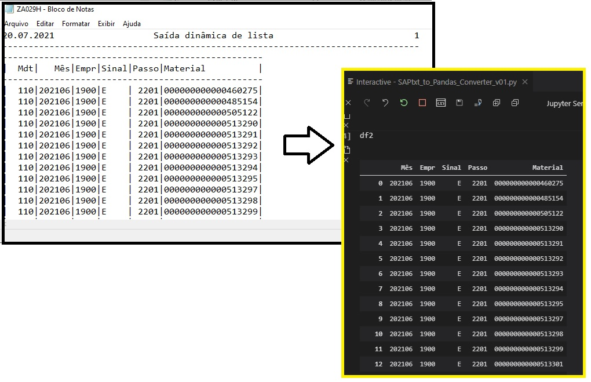
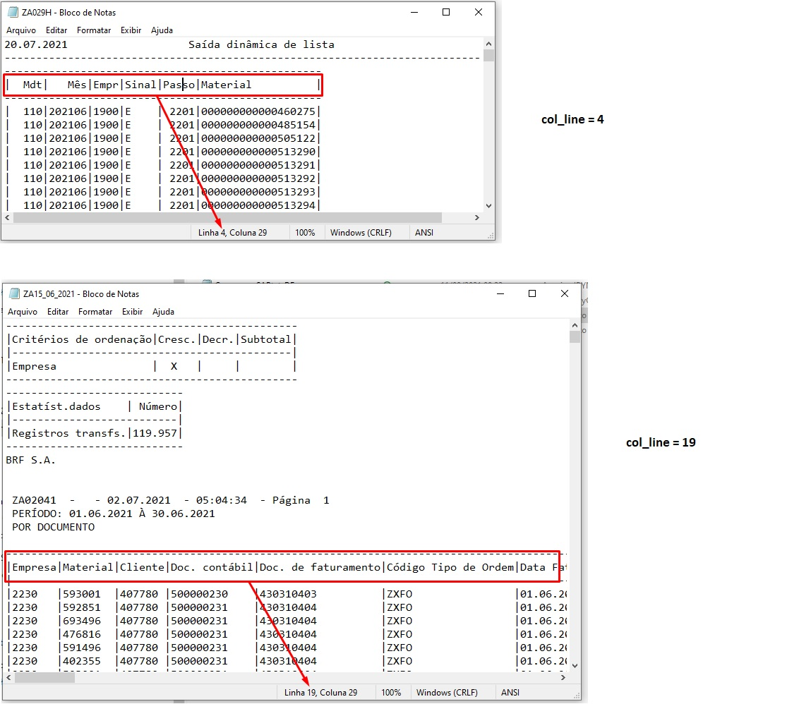

# Tiny Projects

## 1.  SAP Txt into Pandas Dataframe converter
##### File: SAPtxt_to_Pandas_Converter_v01.py

### This function converts a txt file downloaded from SAP into a pandas dataframe
#### There is 2 parameters, first and mandatory is the txt file location (without the 'txt' extention) and secondly (optional) is a int that says where is the columns header of the dataframe inside the txt file. the default is 4 that is usually where the header of a simple unfiltered sap table txt is.

### How does the header is set
#### See 2 examples:

